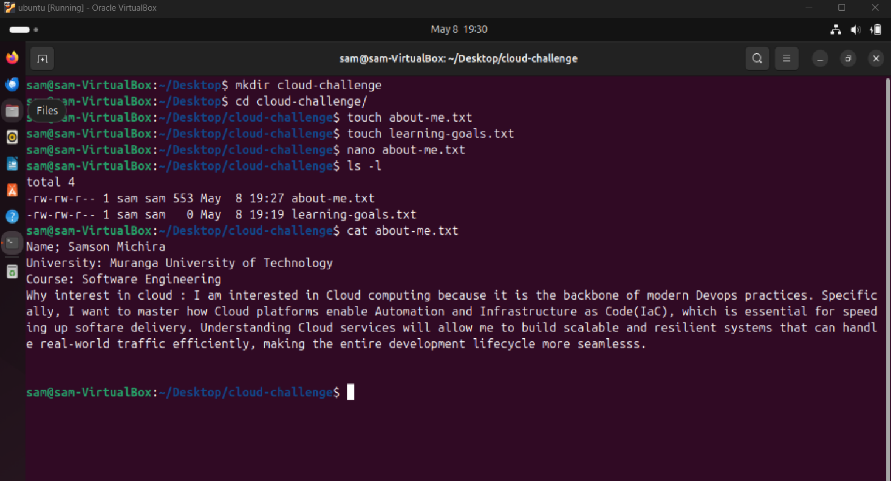
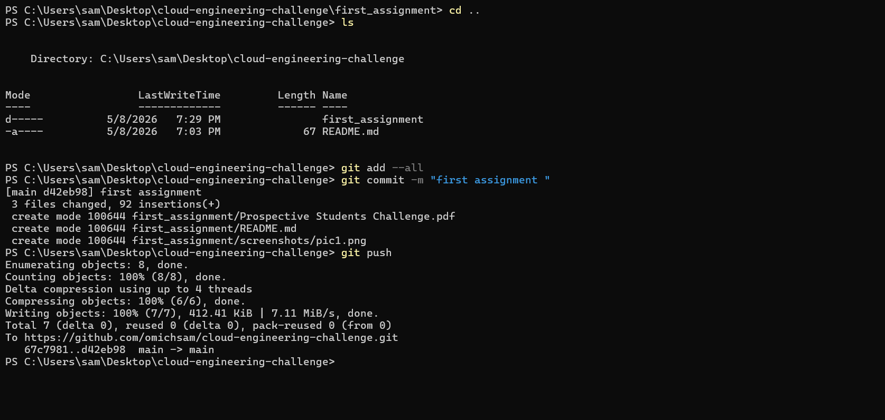
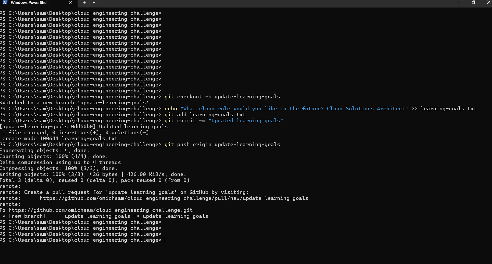
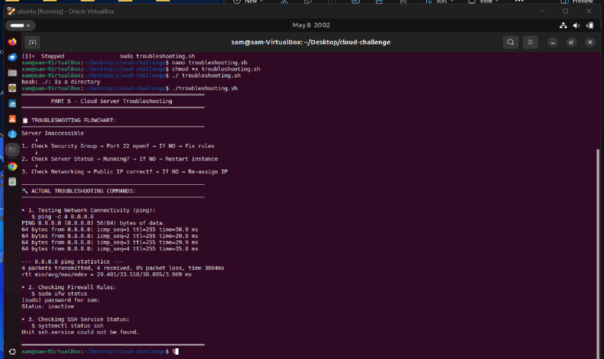

# Cloud Engineering Challenge

Complete submission for the Prospective Students Challenge.

---

## 📦 First Assignment Summary

The first assignment covered the essential foundations of cloud engineering:

| Area | Tasks |
|------|-------|
| **Linux** | Created folders/files (`about-me.txt`, `learning-goals.txt`), added content, displayed with `ls -la` & `cat` |
| **Git & GitHub** | Initialized repo, added files, committed, pushed to remote |
| **Branching** | Created `update-learning-goals` branch, added future cloud role question, committed & pushed |
| **Research** | Defined cloud computing, DevOps, Docker vs Kubernetes, importance of Linux skills |
| **Troubleshooting** | 3 things to check if cloud server is inaccessible |
| **Bonus** | Installed Docker & verified with hello-world container |

### 🔗 Full Details
👉 [View complete first assignment](./first_assignment/README.md)

<!-- ---

## 📸 Screenshots

| Part | Screenshot |
|------|------------|
| 1 – Linux |  |
| 2 – Git |  |
| 3 – Branching |  |
| 4 – Research |  |
| 5 – Troubleshooting |  |
| 6 – Docker |  |

--- -->

**Repository:** [github.com/omichsam/cloud-engineering-challenge](https://github.com/omichsam/cloud-engineering-challenge)

---

## Week 4 – Docker Containerization

[View the Flask + Redis URL Shortener assignment](./week_4_assignment/url-shortener/README.md)
