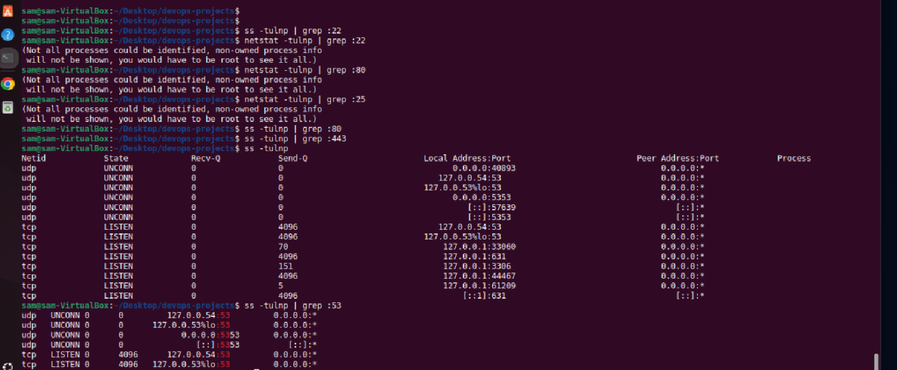
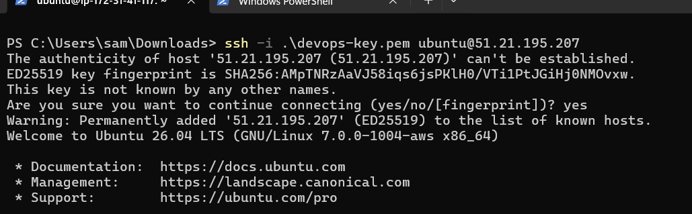
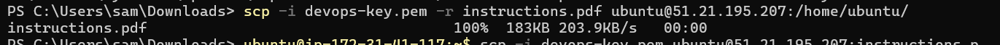
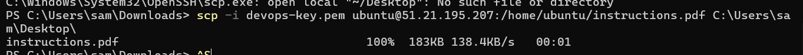
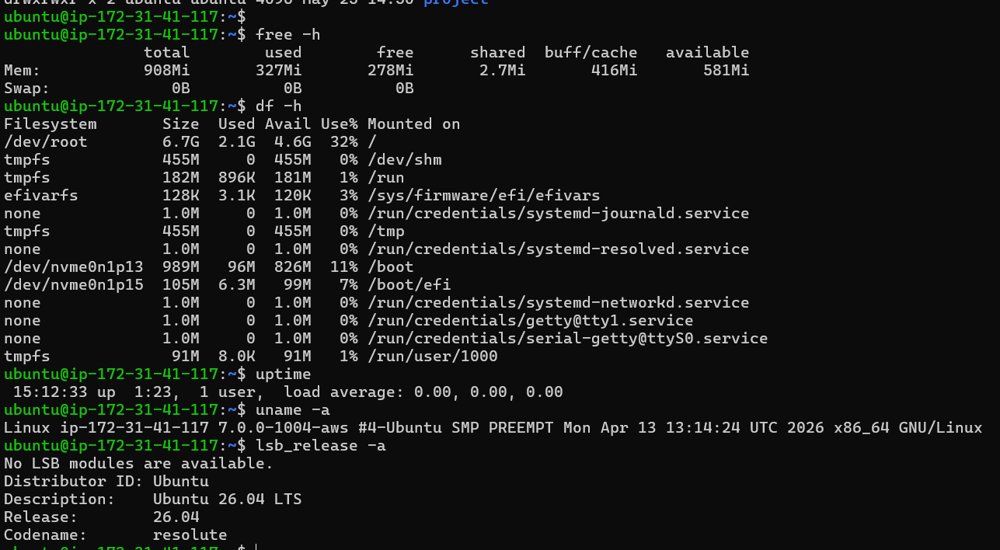
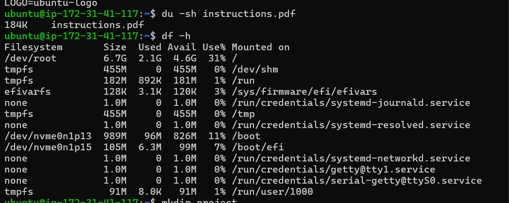
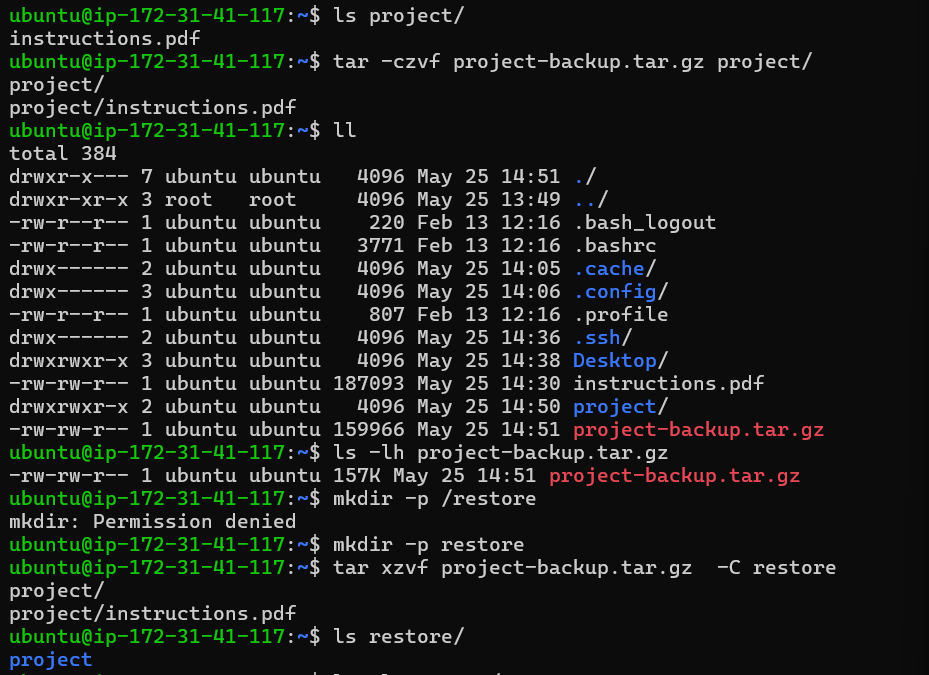

# DevOps Linux Assignment

## PART 1 — File Management

### Task 1 — Create Project Structure

Assignment structure:

```
devops-projects
├── logs
├── backups
├── scripts
├── configs
└── temp
```

**Steps taken:**
```bash
cd ~/Desktop
mkdir devops-projects
cd devops-projects/

# First attempt had a typo
mkdkir logs backups scripts configs temp
# Command 'mkdkir' not found, did you mean: command 'mkdir'

# Corrected
mkdir logs backups scripts configs temp
```

**Verify:**
```bash
ls
# backups  configs  logs  scripts  temp

ll
# drwxrwxr-x  backups/  configs/  logs/  scripts/  temp/
```


---

### Task 2 — Create Files

Create the following files:
- `logs/app.log`
- `scripts/deploy.sh`
- `configs/app.conf`

**Command:**
```bash
touch logs/app.log scripts/deploy.sh configs/app.conf

ls logs/      # app.log
ls scripts/   # deploy.sh
ls configs/   # app.conf
```


---

### Task 3 — Add Sample Content

Add the following content to `app.log`:

```
INFO Server started
WARNING Disk almost full
ERROR Database connection failed
INFO User login successful
```

**Command (used `nano`):**
```bash
nano logs/app.log
```

> Inside `nano`, type the lines, then press `Ctrl + O` to save and `Ctrl + X` to exit.


---

### Task 4 — Copy Backup

Copy `app.conf` to the `backups/` folder.

**Command:**
```bash
cp configs/app.conf backups/
ls backups/
# app.conf
```


---

## PART 2 — File Viewing & Log Investigation

### Task 5 — Investigate Logs

Find `ERROR` and `WARNING` entries in `app.log`.

**Commands:**
```bash
grep "WARNING" logs/app.log
# WARNING Disk almost full

grep "ERROR" logs/app.log
# ERROR Database connection failed

# Case-insensitive variants
grep -i "error" logs/app.log
grep -i "warning" logs/app.log
```


---

### Task 6 — Monitor Logs Live

Continuously watch `app.log` for new entries.

**Commands:**
```bash
# First attempt failed — wrong path (no logs/ prefix)
tail -f app.log
# tail: cannot open 'app.log' for reading: No such file or directory

# Corrected
tail -f logs/app.log
```

> Press `Ctrl + C` to stop monitoring.


---

## PART 3 — Permissions & Ownership

### Task 7 — Script Permissions

Make `deploy.sh` executable.

**Command:**
```bash
chmod +x scripts/deploy.sh
ls -l scripts/deploy.sh
# -rwxrwxr-x 1 sam sam 0 May 20 19:14 scripts/deploy.sh
```


---

### Task 8 — Secure Config File

Set permissions so the owner can read/write and no one else has access.

> *Note: The exercise asks for this on `configs/app.conf`. In my run I applied `600` to `scripts/deploy.sh` instead — the same command works on either file.*

**Command:**
```bash
chmod 600 configs/app.conf
ls -l configs/app.conf
# -rw------- 1 sam sam ... configs/app.conf
```


---

### Task 9 — Explain Permissions

| Permission | Owner | Group | Others | Meaning |
|------------|-------|-------|--------|---------|
| **755** | rwx (read, write, execute) | r-x (read, execute) | r-x (read, execute) | Common for scripts and directories — owner has full control; others can run and view but not modify. |
| **644** | rw- (read, write) | r-- (read) | r-- (read) | Common for regular files like configs and documents — owner can edit; others can only read. |
| **600** | rw- (read, write) | --- (none) | --- (none) | Used for sensitive files such as private keys or credentials — only the owner can read or modify. |

<!--  -->

---

## PART 4 — Process Management

### Task 10 — Start Background Process

Run `sleep 500` in the background.

> *Note: In my run, I first ran `sleep 500` in the foreground (without `&`), which blocked the terminal. The correct way is to append `&`.*

**Command:**
```bash
sleep 500 &
```


---

### Task 11 — Identify Process

Find the PID and process name.

**Commands used:**
```bash
ps aux                  # full list of all processes
ps aux | grep sleep     # filter for the sleep process
pgrep -l sleep          # shorter alternative — prints PID and name
# 5928 sleep
```


---

### Task 12 — Terminate Process

Stop the process safely.

**Commands:**
```bash
pgrep -l sleep
# 5928 sleep

kill 5928               # graceful termination
# (after this, the process is gone)

kill -9 5928            # force kill (only if it didn't die)
# bash: kill: (5928) - No such process   ← already terminated
```


---

### Task 13 — Monitor System

Check running processes, CPU usage, and memory usage.

**Commands:**
```bash
top              # interactive process viewer (press q to quit)
free -m          # memory usage in MB
vmstat           # system performance summary
ps aux           # snapshot of all running processes

# Installed extra tools for richer monitoring
sudo apt install htop
htop

sudo apt install glances
glances
```

**Memory snapshot example (`free -m`):**
```
               total        used        free      shared  buff/cache   available
Mem:            7940        2409         989         101        4923        5530
Swap:           4095           0        4095
```


---

## PART 5 — Networking & Connectivity

### Task 14 — Find Server IP

Display IP address and hostname.

**Commands:**
```bash
ip addr show       # detailed interface info
hostname -I        # short list of IP addresses
hostname           # hostname: sam-VirtualBox

# Installed net-tools for the classic ifconfig command
sudo apt install net-tools
ifconfig
```

**Key results:**
- Hostname: `sam-VirtualBox`
- Main interface `enp0s3`: `10.0.2.15/24`
- Docker bridge `docker0`: `172.17.0.1/16`


---

### Task 15 — Test Connectivity

Verify internet access.

**Commands:**
```bash
ping -c 4 8.8.8.8
# 4 packets transmitted, 4 received, 0% packet loss

wget google.com    # downloads index.html — confirms HTTP works
dig                # DNS query — confirms resolver works
```


---

### Task 16 — Verify Listening Ports

Confirm SSH (port 22) and web server (port 80) are listening.

**Commands:**
```bash
ss -tulnp | grep :22       # no output → SSH not running locally
ss -tulnp | grep :80       # no output → no web server running
netstat -tulnp | grep :22  # same result via netstat

# Full list of listening ports on this machine
ss -tulnp
```

**Observation:** On this VM, neither SSH nor a web server is listening. What *is* listening:
- `53` — local DNS resolver (systemd-resolved)
- `631` — CUPS print service
- `3306` / `33060` — MySQL
- `61209` — Glances web UI

To make SSH listen, install and start it:
```bash
sudo apt install openssh-server
sudo systemctl enable --now ssh
ss -tulnp | grep :22
```



---

## PART 6 — SSH & SCP

### Task 17 — Remote Access (Local to Remote)

**Setup:**
1. Sign up for AWS Educate (if you don't have an account).
2. Launch an EC2 Linux instance (Ubuntu).
3. Create a Security Group allowing SSH on port 22.
4. Download the `.pem` key pair.
5. Note the EC2 instance's public IP.

**Set correct permissions on the key (required by SSH):**
```bash
chmod 400 your-key.pem
```

**Connect from your Linux PC:**
```bash
ssh -i your-key.pem ubuntu@public-ip
```



---

### Task 18 — Secure File Transfer

Recursively upload the working folder to the remote EC2 instance.

**Command:**
```bash
scp -i your-key.pem -r ~/Desktop/devops-projects ubuntu@ec2-public-ip:/home/ubuntu
```



---

### Task 19 — Retrieve File (Remote to Local)

Download `app.log` from the remote EC2 instance to a new local folder.

**Commands:**
```bash
mkdir -p ~/Desktop/downloaded-logs

scp -i your-key.pem ubuntu@ec2-public-ip:/home/ubuntu/devops-projects/logs/app.log ~/Desktop/downloaded-logs/
```



---

## PART 7 — Disk & System Information

### Task 20 — Check System Resources

Display RAM usage, disk usage, uptime, and Linux version.

**Commands:**
```bash
free -h              # RAM usage
df -h                # disk usage
uptime               # system uptime and load
uname -a             # kernel/Linux version
lsb_release -a       # distribution version (Ubuntu)
```



---

### Task 21 — Analyze Storage

Determine the size of the project directory and available disk space.

**Commands:**
```bash
du -sh ~/Desktop/devops-projects   # size of project directory
df -h ~                            # available disk space on home
```



---

## PART 8 — Compression & Backups

### Task 22 — Create Backup Archive

Compress `devops-projects` into `devops-backup.tar.gz`.

**Command:**
```bash
cd ~/Desktop
tar -czvf devops-backup.tar.gz devops-projects
ls -lh devops-backup.tar.gz
```

**Flags explained:**
- `c` — create archive
- `z` — gzip compression
- `v` — verbose (show files being archived)
- `f` — filename of the archive



---

### Task 23 — Extract Backup

Extract the archive into `~/Desktop/restore`.

**Commands:**
```bash
mkdir -p ~/Desktop/restore
tar -xzvf devops-backup.tar.gz -C ~/Desktop/restore
ls ~/Desktop/restore
```

**Flags explained:**
- `x` — extract
- `z` — gzip
- `v` — verbose
- `f` — filename
- `-C` — change to this directory before extracting


---

## Lessons Learned / Notes from This Run

- **Typos matter.** `mkdkir` is not `mkdir`. Bash will suggest the correct command — read the hint.
- **Paths are relative to where you are.** `tail -f app.log` failed; `tail -f logs/app.log` worked, because `app.log` lives inside `logs/`.
- **Background vs foreground.** `sleep 500` alone blocks the terminal. `sleep 500 &` runs it in the background so you keep your prompt.
- **`kill` after a process is dead** gives `No such process` — that's confirmation it worked, not an error to fix.
- **Missing tools are easy to install.** `htop`, `glances`, `net-tools` (for `ifconfig`), and `curl` weren't installed by default — `sudo apt install <name>` fixes that.
- **Services have to be running to listen on a port.** Empty output from `ss -tulnp | grep :22` simply means SSH isn't installed/running on this machine yet.

---

