# Log Analysis Lab — Linux Text Processing

> **How to use this template:** Each task has an image placeholder like ``. Replace the path with your actual screenshot file. Keep screenshots in an `images/` folder next to this markdown file.

---

## Setup — Create the Lab

Run this script once to create the lab files in `~/loglab/logs/`:

```bash
# =========================================
# CREATE LOG ANALYSIS LAB
# =========================================
mkdir -p ~/loglab/logs
cd ~/loglab/logs

# Create application log
cat > app.log <<EOF
2026-05-12 08:00:01 INFO User john logged in
2026-05-12 08:05:11 ERROR Database connection failed
2026-05-12 08:07:45 WARNING Disk usage at 85%
2026-05-12 08:10:15 INFO User mary uploaded file
2026-05-12 08:15:22 ERROR Failed password attempt from 192.168.1.50
2026-05-12 08:20:10 INFO Backup completed successfully
2026-05-12 08:25:41 ERROR API timeout from server1
2026-05-12 08:30:55 WARNING High memory usage detected
2026-05-12 08:35:33 INFO User admin logged out
2026-05-12 08:40:18 ERROR Disk write failure
EOF

# Create auth log
cat > auth.log <<EOF
May 12 09:00:01 sshd[101]: Accepted password for ubuntu
May 12 09:02:15 sshd[102]: Failed password for root
May 12 09:05:22 sshd[103]: Failed password for admin
May 12 09:10:18 sshd[104]: Accepted password for devops
May 12 09:12:45 sshd[105]: Failed password for testuser
EOF

# Create system log
cat > system.log <<EOF
CPU usage: 45%
Memory usage: 68%
Disk usage: 91%
CPU usage: 88%
Memory usage: 92%
Disk usage: 95%
EOF

echo "Lab files created successfully"
```

**Verify the files exist:**
```bash
ls -l ~/loglab/logs/
# app.log  auth.log  system.log
```


---

## PART 1 — `find` Command

### Task 1 — Find all `.log` files

**Command:**
```bash
find ~/loglab -name "*.log"
```

**Expected output:**
```
/home/<user>/loglab/logs/app.log
/home/<user>/loglab/logs/auth.log
/home/<user>/loglab/logs/system.log
```

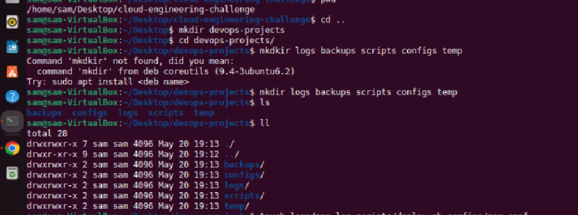

---

### Task 2 — Find files containing "app" in filename

**Command:**
```bash
find ~/loglab -name "*app*"
```

**Expected output:**
```
/home/<user>/loglab/logs/app.log
```


---

## PART 2 — `locate` Command

### Task 3 — Locate `auth.log`

**Command:**
```bash
locate auth.log
```

> **If `locate` is not installed:**
> ```bash
> sudo apt install plocate     # or: sudo apt install mlocate
> ```
>
> **If the locate database is outdated** (newly created files won't be found):
> ```bash
> sudo updatedb
> locate auth.log
> ```

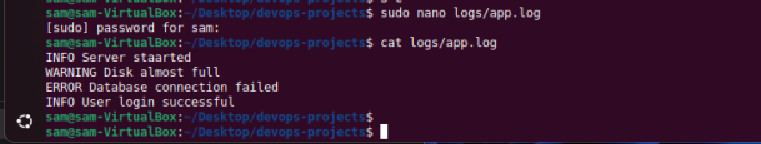

---

## PART 3 — `grep` Command

### Task 4 — Find all ERROR messages in `app.log`

**Command:**
```bash
grep "ERROR" ~/loglab/logs/app.log
```

**Expected output:**
```
2026-05-12 08:05:11 ERROR Database connection failed
2026-05-12 08:15:22 ERROR Failed password attempt from 192.168.1.50
2026-05-12 08:25:41 ERROR API timeout from server1
2026-05-12 08:40:18 ERROR Disk write failure
```


---

### Task 5 — Find all WARNING messages

**Command:**
```bash
grep "WARNING" ~/loglab/logs/app.log
```

**Expected output:**
```
2026-05-12 08:07:45 WARNING Disk usage at 85%
2026-05-12 08:30:55 WARNING High memory usage detected
```

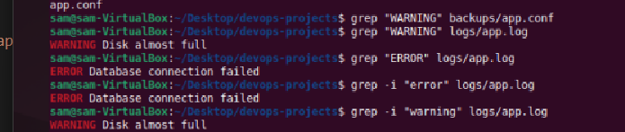

---

### Task 6 — Count the number of ERROR entries

**Command:**
```bash
grep "ERROR" ~/loglab/logs/app.log | wc -l
# 4

# Equivalent shortcut
grep -c "ERROR" ~/loglab/logs/app.log
```

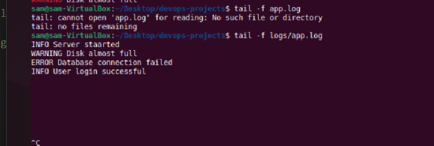

---

## PART 4 — `awk` Command

### Task 7 — Print only timestamps from `app.log`

The timestamp is the first two fields (date + time).

**Command:**
```bash
awk '{print $1, $2}' ~/loglab/logs/app.log
```

**Expected output:**
```
2026-05-12 08:00:01
2026-05-12 08:05:11
2026-05-12 08:07:45
...
```

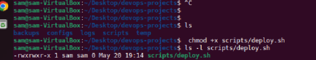

---

### Task 8 — Print only usernames from successful login entries

Successful logins are lines containing `Accepted password for <user>`. The username is the last field.

**Command:**
```bash
grep "Accepted" ~/loglab/logs/auth.log | awk '{print $NF}'
```

**Expected output:**
```
ubuntu
devops
```

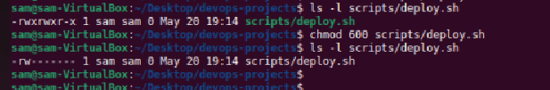

---

### Task 9 — Extract disk usage percentages from `system.log`

The relevant lines start with `Disk usage:` — the percentage is the third field.

**Command:**
```bash
grep "Disk usage" ~/loglab/logs/system.log | awk '{print $3}'
```

**Expected output:**
```
91%
95%
```


---

## PART 5 — Piping

### Task 10 — Find ERROR logs and count them

**Command:**
```bash
grep "ERROR" ~/loglab/logs/app.log | wc -l
# 4
```

**Flow:** `grep` → `wc -l`


---

### Task 11 — Extract usernames and sort alphabetically

**Command:**
```bash
grep "Accepted\|Failed" ~/loglab/logs/auth.log | awk '{print $NF}' | sort
```

**Expected output:**
```
admin
devops
root
testuser
ubuntu
```

**Flow:** `grep` → `awk` → `sort`

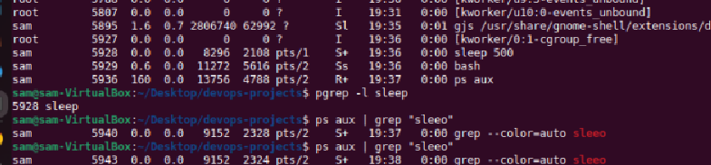

---

### Task 12 — Find failed SSH logins and count occurrences

**Command:**
```bash
grep "Failed" ~/loglab/logs/auth.log | awk '{print $NF}' | sort | uniq -c
```

**Expected output:**
```
      1 admin
      1 root
      1 testuser
```

**Flow:** `grep` → `awk` → `sort` → `uniq -c`

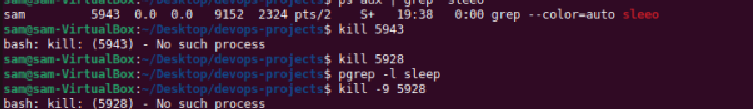

---

## PART 6 — `xargs`

### Task 13 — Create `loglist.txt`

**Command:**
```bash
cd ~/loglab/logs
cat > loglist.txt <<EOF
app.log
auth.log
system.log
EOF

cat loglist.txt
```

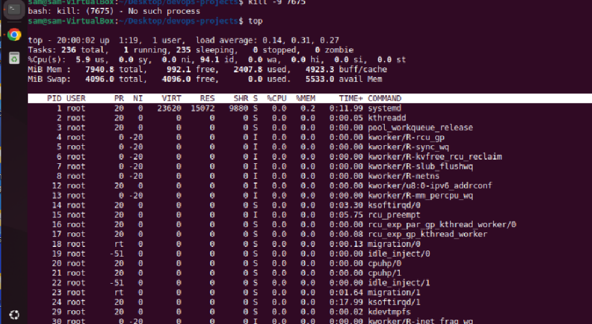

---

### Task 14 — Use `xargs` to display all logs with `cat`

**Command:**
```bash
cat loglist.txt | xargs cat
```

> This reads each filename from `loglist.txt` and passes them as arguments to `cat`, which then prints the contents of every file in sequence.

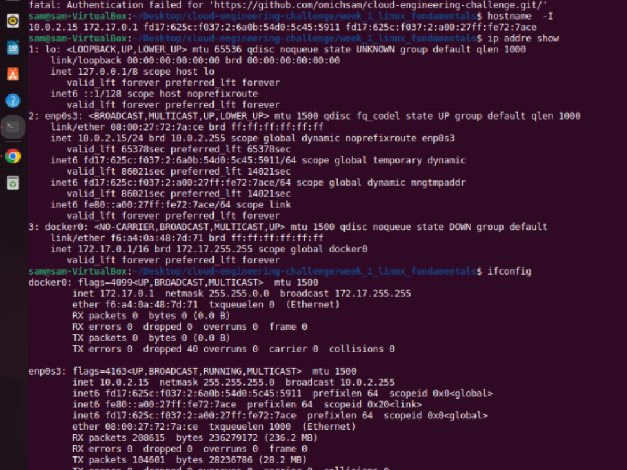

---

### Task 15 — Use `xargs` to search ERROR in all listed logs

**Command:**
```bash
cat loglist.txt | xargs grep "ERROR"
```

**Expected output:**
```
app.log:2026-05-12 08:05:11 ERROR Database connection failed
app.log:2026-05-12 08:15:22 ERROR Failed password attempt from 192.168.1.50
app.log:2026-05-12 08:25:41 ERROR API timeout from server1
app.log:2026-05-12 08:40:18 ERROR Disk write failure
```

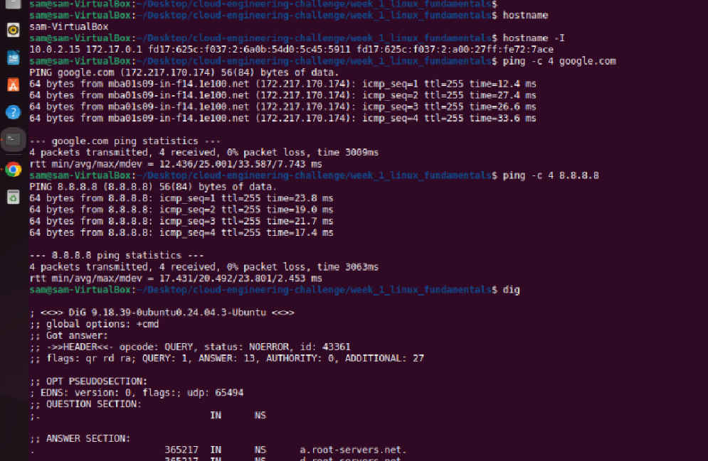

---

## Advanced Challenge — Server Health Summary

**Scenario:** The server is unstable. Investigate and summarize.

### Step 1 — Identify the disk issue

```bash
grep -i "disk" ~/loglab/logs/app.log ~/loglab/logs/system.log
```


---

### Step 2 — Identify failed logins

```bash
grep "Failed" ~/loglab/logs/auth.log | awk '{print $NF}' | sort | uniq -c
```


---

### Step 3 — Count errors

```bash
grep -c "ERROR" ~/loglab/logs/app.log
```


---

### Step 4 — Locate logs

```bash
sudo updatedb
locate loglab
# or
find ~ -name "*.log" 2>/dev/null
```


---

### Step 5 — Summarize system health

```bash
echo "=== SERVER HEALTH REPORT ==="
echo ""
echo "Total ERRORs in app.log:"
grep -c "ERROR" ~/loglab/logs/app.log

echo ""
echo "Disk usage readings:"
grep "Disk usage" ~/loglab/logs/system.log | awk '{print $3}'

echo ""
echo "Failed login attempts (by user):"
grep "Failed" ~/loglab/logs/auth.log | awk '{print $NF}' | sort | uniq -c

echo ""
echo "Successful logins:"
grep -c "Accepted" ~/loglab/logs/auth.log
```


---

## Quick Reference

| Tool | Purpose |
|------|---------|
| `find` | Search the filesystem for files matching a pattern (always up to date, slower). |
| `locate` | Search a prebuilt database — fast, but may be stale (run `sudo updatedb`). |
| `grep` | Search file contents for matching lines. |
| `awk` | Extract or process specific columns/fields from text. |
| `wc -l` | Count lines (often piped after `grep`). |
| `sort` | Sort lines alphabetically or numerically. |
| `uniq -c` | Collapse duplicates and count occurrences (input must be sorted). |
| `xargs` | Take input lines and turn them into command arguments. |

---


