# 🧪 Git Collaboration Labs — Complete Step-by-Step Guide

> **Two labs covering Git branching, merging, conflict resolution, rebase, hotfixes, multiple remotes, tagging, and undo workflows.**

---

## Table of Contents

- [Lab 1 — Branching, Merging & Conflict Resolution](#lab-1--branching-merging--conflict-resolution)
  - [Setup](#-setup--initialize-your-repository)
  - [Part 1 — Create the Navbar Branch](#-part-1--create-the-navbar-branch)
  - [Part 2 — Simulate a Second Developer](#-part-2--simulate-a-second-developer)
  - [Part 3 — Create the Merge Conflict](#-part-3--create-the-merge-conflict)
  - [Part 4 — Resolve the Conflict](#-part-4--resolve-the-conflict)
  - [Part 5 — Push to GitHub](#-part-5--push-to-github)
  - [Lab 1 Deliverables](#-lab-1-deliverables)
- [Lab 2 — Advanced Git & DevOps Workflow](#lab-2--advanced-git--devops-workflow)
  - [Setup](#-setup--initialize-the-cloud-platform-repo)
  - [Part 1 — Feature Development](#-part-1--feature-development)
  - [Part 2 — Production Hotfix](#-part-2--production-hotfix-emergency)
  - [Part 3 — Rebase Feature Branch](#-part-3--rebase-feature-branch-onto-main)
  - [Part 4 — Stashing](#-part-4--stashing-uncommitted-work)
  - [Part 5 — Multiple Remotes](#-part-5--multiple-remote-repositories)
  - [Part 6 — Release Tagging](#-part-6--release-tagging)
  - [Part 7 — Undo a Mistake](#-part-7--undo-a-mistake)
  - [Lab 2 Deliverables](#-lab-2-deliverables)
- [Quick Reference](#-quick-reference)

---

# Lab 1 — Branching, Merging & Conflict Resolution

> **Scenario:** You are building a company website. Two developers work on different features simultaneously, edit the same file, and you must resolve the resulting merge conflict.

---

## 🛠 Setup — Initialize Your Repository

### Step 1 — Create the project folder and initialize Git

```bash
mkdir company-website
cd company-website
git init
```
<!-- 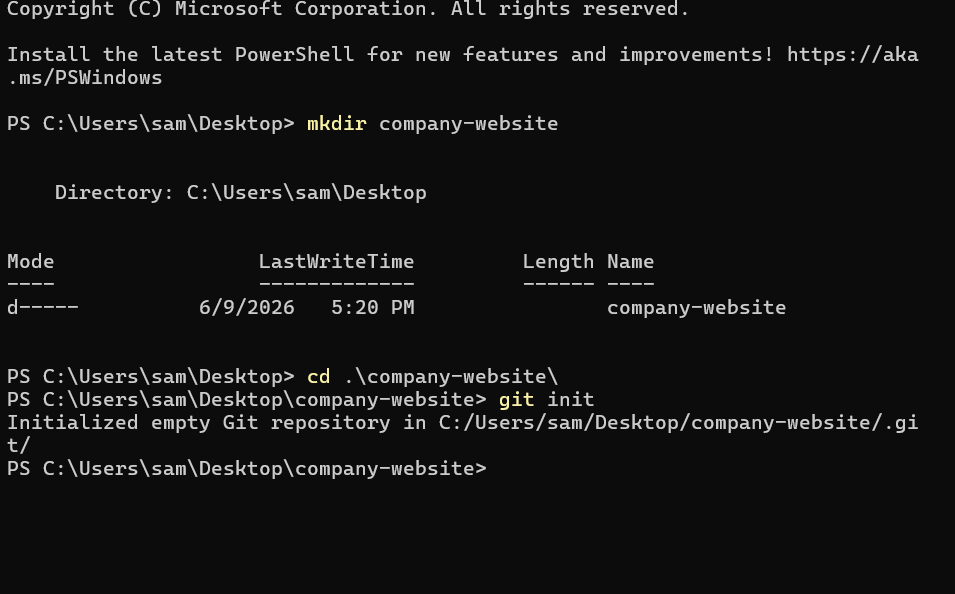 -->


**Screenshot — what you should see:**


---

### Step 2 — Create the homepage file

```bash
echo "Welcome to Company Website" > index.html
```

This creates your HTML file — the one that will be edited by both branches later, causing the conflict.

---

### Step 3 — Stage and commit the initial file

```bash
git add .
git commit -m "Initial website commit"
```

**Screenshot — what you should see:**


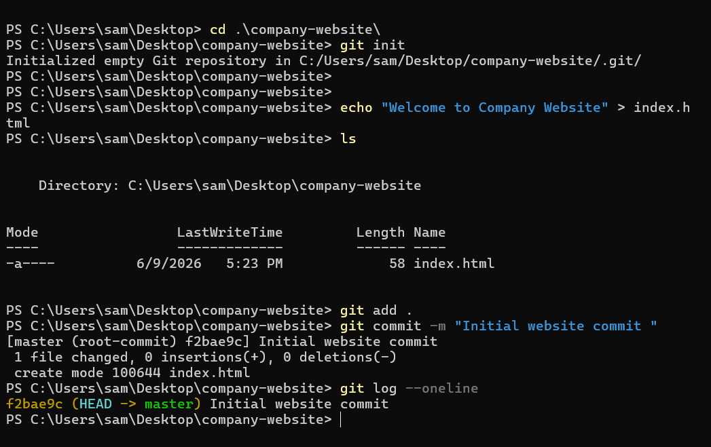


> 💡 Run `git log --oneline` to confirm you see your first commit listed.

---

## 🌿 Part 1 — Create the Navbar Branch

### Step 4 — Create and switch to feature-navbar

```bash
git checkout -b feature-navbar
```

**Screenshot — what you should see:**


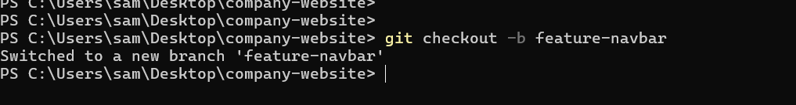


---

### Step 5 — Add navigation content to index.html

```bash
echo "Navigation Bar Added" >> index.html
```

> ⚠️ **Important for triggering a conflict:** Also open `index.html` and change the first line from `"Welcome to Company Website"` to something unique like `"Company Website - Navigation Version"`.

---

### Step 6 — Commit the navbar changes

```bash
git add .
git commit -m "Added navigation bar"
```

---

## 👤 Part 2 — Simulate a Second Developer

### Step 7 — Switch back to main

```bash
git checkout master
```


**Screenshot — what you should see:**
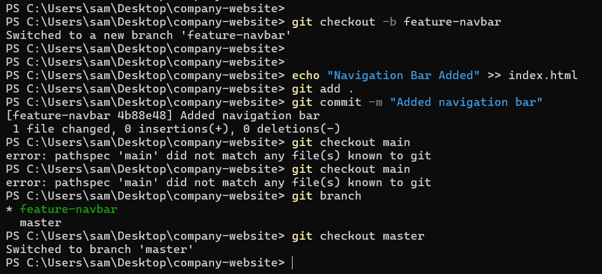


---

### Step 8 — Create the feature-footer branch

```bash
git checkout -b feature-footer
```

---

### Step 9 — Add footer content and edit the same first line

```bash
echo "Footer Added" >> index.html
```

Open `index.html` and change the first line to something **different** from what you wrote in feature-navbar — e.g. `"Company Website - Footer Version"`.

> This ensures both branches have changed the same line → merge conflict guaranteed.

---

### Step 10 — Commit the footer changes

```bash
git add .
git commit -m "Added footer section"
```

---

## ⚡ Part 3 — Create the Merge Conflict

### Step 11 — Switch to main and merge navbar (clean merge)

```bash
git checkout master
git merge feature-navbar
```

**Screenshot — clean merge:**
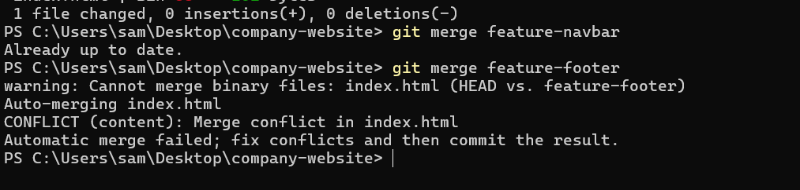


---

### Step 12 — Merge feature-footer — this triggers the conflict

```bash
git merge feature-footer
```


**Screenshot — merge conflict:**


> ✅ This was **expected**. Git cannot decide which version of the same line to keep — you must decide.

---

## 🔧 Part 4 — Resolve the Conflict

### Step 13 — Check which files are conflicted

```bash
git status
```

**Screenshot — git status during conflict:**

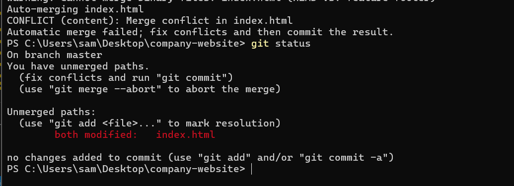


---

### Step 14 — Open index.html and read the conflict markers

When you open the file, you will see this:

```
<<<<<<< HEAD
Company Website - Navigation Version
=======
Company Website - Footer Version
>>>>>>> feature-footer
Navigation Bar Added
Footer Added
```

**What each marker means:**

| Marker | Meaning |
|--------|---------|
| `<<<<<<< HEAD` | Your current branch's version (main after navbar merge) |
| `=======` | Divider between the two versions |
| `>>>>>>> feature-footer` | The incoming branch's version |

---

### Step 15 — Edit the file to resolve the conflict

Delete ALL conflict markers and keep the version you want (or combine both):

**Resolved index.html should look like:**

```
Welcome to Company Website
Navigation Bar Added
Footer Added
```

> ⚠️ Made sure NO `<<<<<<<`, `=======`, or `>>>>>>>` markers remain in the file.

---

### Step 16 — Stage and commit the resolution

```bash
git add .
git commit -m "Resolved merge conflict"
```

**Screenshot — successful merge commit:**
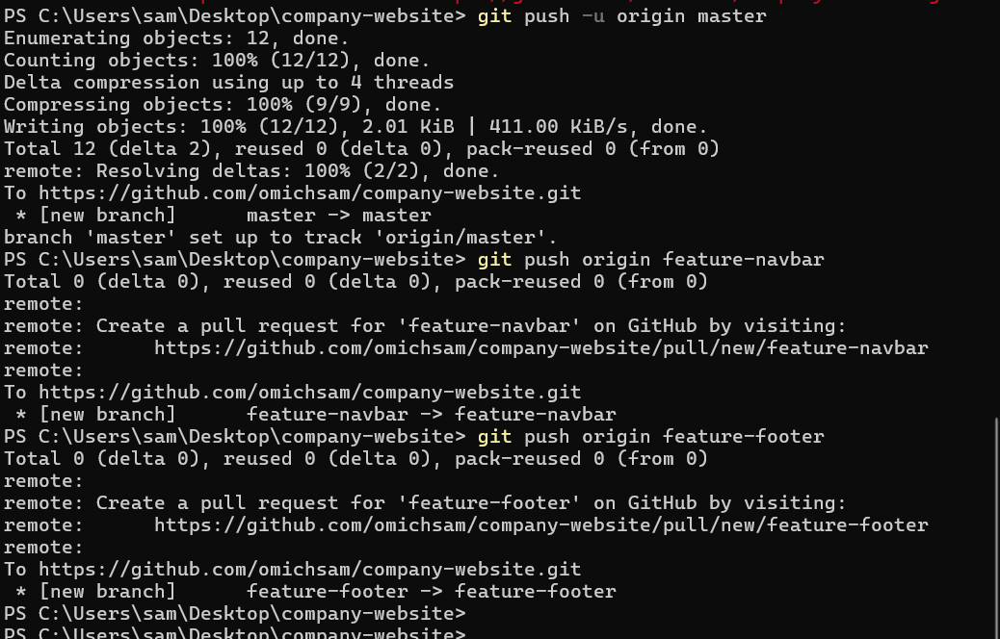


---

## 🚀 Part 5 — Push to GitHub

### Step 17 — Create a new repo on GitHub

Go to [github.com](https://github.com) → click **New Repository** → name it `company-website` → **do NOT** initialize with a README.

---

### Step 18 — Add remote and push

```bash
git remote add origin https://github.com/YOUR-USERNAME/company-website.git
git push -u origin master
```

---

### Step 19 — Push feature branches too

```bash
git push origin feature-navbar
git push origin feature-footer
```

---

## ✅ Lab 1 Deliverables

- [ ] GitHub repository URL
- [ ] Screenshot of the merge conflict (`<<<<<<` markers visible in the file)
- [ ] Screenshot of the resolved file
- [ ] Output of the following command:

```bash
git log --oneline --graph
```

**Expected output should look like:**
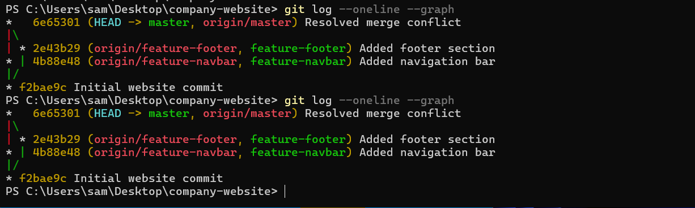


---
---

# Lab 2 — Advanced Git & DevOps Workflow

> **Scenario:** You are on a cloud engineering team. A production bug appears while feature development is in progress. You must handle the emergency hotfix, rebase, stash work, push to multiple remotes, tag a release, and undo a mistake.

---

## 🛠 Setup — Initialize the Cloud Platform Repo

### Step 1 — Create project and initialize Git

```bash
mkdir cloud-platform
cd cloud-platform
git init
```

---

### Step 2 — Create the app file and make the first commit

```bash
echo "Cloud Platform v1" > app.txt
git add .
git commit -m "Initial platform commit"
```

---

## 🌿 Part 1 — Feature Development

### Step 3 — Create the monitoring feature branch

```bash
git checkout -b feature-monitoring
```

---

### Step 4 — Add monitoring code and commit

```bash
echo "Monitoring dashboard enabled" >> app.txt
git add .
git commit -m "Added monitoring dashboard"
```

**Branch state so far:**

```
main          ──●──────────────────
                 \
feature-monitoring ──●── (monitoring commit)
```

---

## 🚨 Part 2 — Production Hotfix (Emergency!)

> A critical authentication bug has been found. Stop feature work immediately.

### Step 5 — Switch back to main

```bash
git checkout master
```

> 💡 Always branch a hotfix from `master` — never from a feature branch.

---

### Step 6 — Create the hotfix branch

```bash
git checkout -b hotfix-authentication
```

---

### Step 7 — Apply the fix and commit

```bash
echo "Critical authentication fix" >> app.txt
git add .
git commit -m "Fixed production authentication bug"
```

---

### Step 8 — Merge hotfix into main immediately

```bash
git checkout master
git merge hotfix-authentication
```

**Screenshot — hotfix merged:**
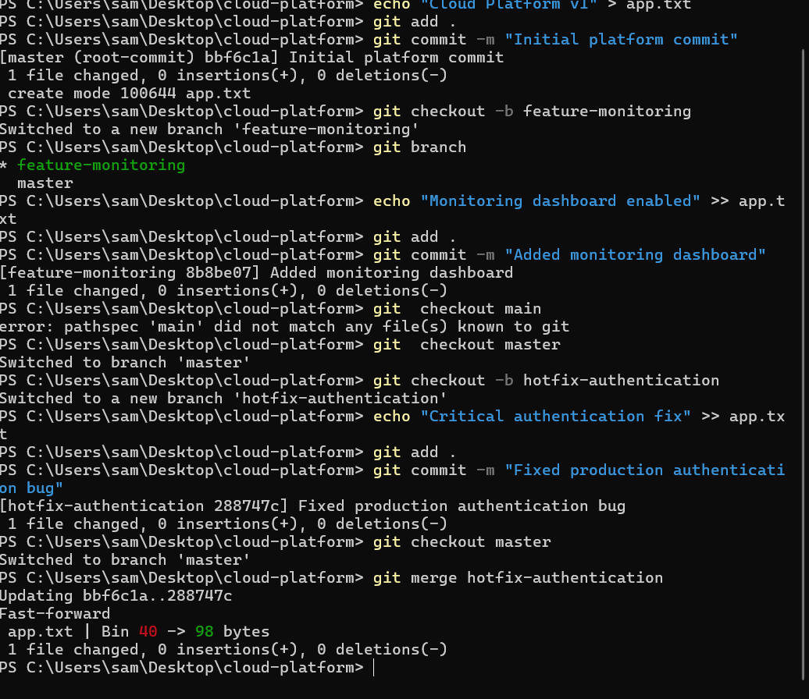


**Branch state after hotfix:**

```
main          ──●──────────────●── (hotfix merged)
                 \              \
feature-monitoring ──●           hotfix-authentication ──●
```

> ⚠️ `feature-monitoring` is now **behind** main. It doesn't have the hotfix commit. Fix this with rebase.

---

## 🔄 Part 3 — Rebase Feature Branch onto Main

### Step 9 — Switch to the feature branch

```bash
git checkout feature-monitoring
```

---

### Step 10 — Rebase onto main

```bash
git rebase master
```

**Screenshot — successful rebase:**
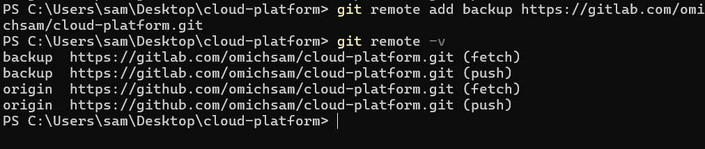


**If there is a conflict during rebase:**

```bash
# 1. Open the conflicted file and fix it
# 2. Stage the fix
git add .
# 3. Continue the rebase
git rebase --continue
# OR abort and start over
git rebase --abort
```

**Branch state after rebase:**

```
BEFORE rebase:                     AFTER rebase:
main ──●──●(hotfix)                main ──●──●(hotfix)
        \                                          \
feature  ──●(monitoring)           feature          ──●(monitoring)
```

> 💡 **Rebase vs Merge:** Merge creates a merge commit (parallel history visible). Rebase replays your commits on top of the target — clean linear history. Use rebase to update feature branches; use merge to integrate features into main.

---

## 📦 Part 4 — Stashing Uncommitted Work

### Step 11 — Simulate in-progress work (do NOT commit)

```bash
echo "Work in progress..." >> app.txt
```

---

### Step 12 — Stash the changes

```bash
git stash
```

**Screenshot — stash:**
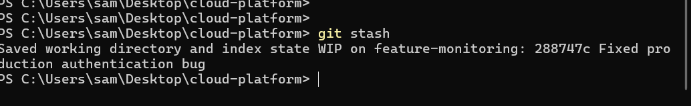


---

### Step 13 — Safely switch to main

```bash
git checkout master
```

The working directory is now clean — Git lets you switch freely.

---

### Step 14 — Return to feature branch and restore the stash

```bash
git checkout feature-monitoring
git stash pop
```

**Screenshot — stash pop:**
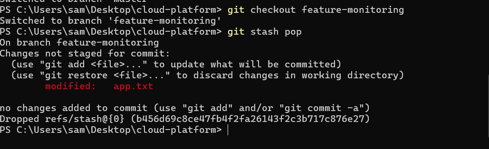


> 💡 `git stash list` shows all stashed items if you have multiple stashes.

---

## 🌐 Part 5 — Multiple Remote Repositories

### Step 15 — Create repos on both GitHub and GitLab

- Go to [github.com](https://github.com) → New repo → `cloud-platform` (empty, no README)
- Go to [gitlab.com](https://gitlab.com) → New project → `cloud-platform` (empty, no README)

---

### Step 16 — Add both remotes

```bash
git remote add origin https://github.com/YOUR-USERNAME/cloud-platform.git
git remote add backup https://gitlab.com/YOUR-USERNAME/cloud-platform.git
```

---

### Step 17 — Verify remotes are configured

```bash
git remote -v
```

**Screenshot — remote -v output:**


<!-- ```
┌─────────────────────────────────────────────────────────────┐
│  $ git remote -v                                            │
│  backup  https://gitlab.com/YOUR-USERNAME/cloud-platform    │
│          .git (fetch)                                       │
│  backup  https://gitlab.com/YOUR-USERNAME/cloud-platform    │
│          .git (push)                                        │
│  origin  https://github.com/YOUR-USERNAME/cloud-platform    │
│          .git (fetch)                                       │
│  origin  https://github.com/YOUR-USERNAME/cloud-platform    │
│          .git (push)                                        │
└─────────────────────────────────────────────────────────────┘
``` -->

---

### Step 18 — Push to both remotes

```bash
git checkout master
git push -u origin master
git push -u backup master
```

---

## 🏷 Part 6 — Release Tagging

### Step 19 — Make sure you are on main

```bash
git checkout master
```

---

### Step 20 — Create an annotated release tag

```bash
git tag -a v1.0 -m "Production release version 1.0"
```

> Annotated tags include metadata: who tagged, when, and a message. Always use `-a` for release tags.

---

### Step 21 — Push tags to remotes

```bash
git push origin --tags
git push backup --tags
```

**Screenshot — tag pushed to GitHub:**

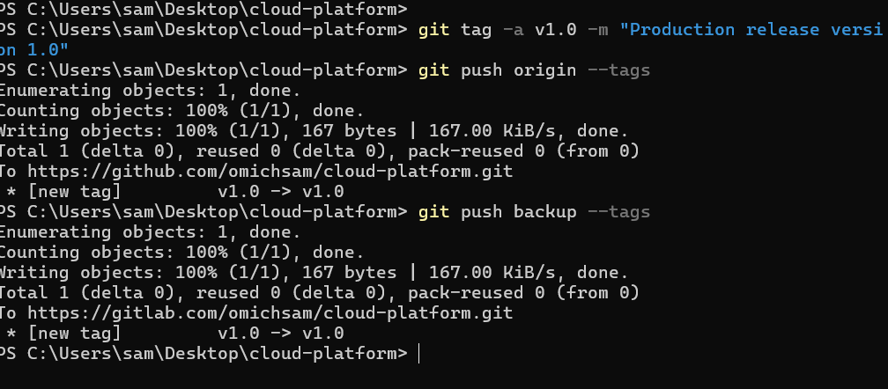


> 💡 On GitHub, tags appear under **Releases**. Click "Create release from tag" to add release notes.

---

## ↩️ Part 7 — Undo a Mistake

### Step 22 — Make a bad commit (to practice undoing)

```bash
echo "WRONG CONTENT" >> app.txt
git add .
git commit -m "Accidental wrong commit"
```

---

### Option A — `git reset --soft` (use when NOT yet pushed)

Undoes the last commit but keeps your changes staged. Safe only for local commits.

```bash
git reset --soft HEAD~1
```

**Screenshot — reset --soft:**
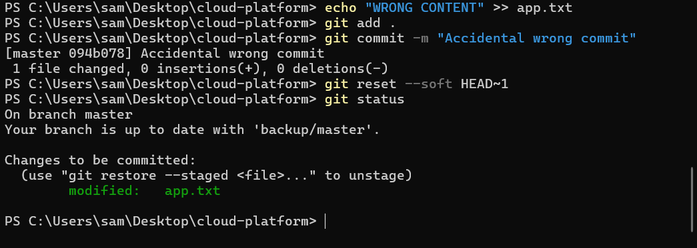


---

### Option B — `git revert` (use when ALREADY pushed)

Creates a NEW commit that undoes the bad one. Does NOT rewrite history — safe for shared branches.

```bash
# First, find the commit ID
git log --oneline

# Then revert it
git revert 2b657f1 
```

**Screenshot — git revert:**

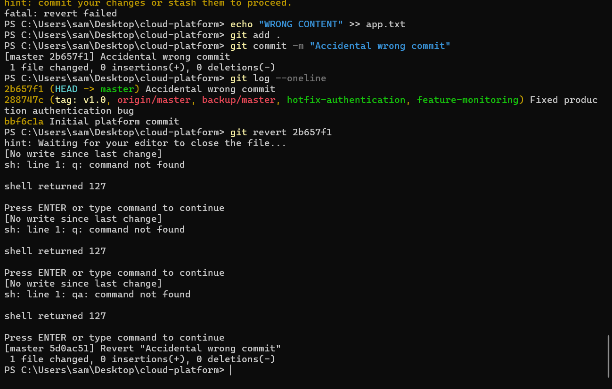


> ⚠️ **Never** use `git reset --hard` on commits already pushed to a shared remote — it rewrites history and breaks teammates' repos.

---

## ✅ Lab 2 Deliverables

- [ ] Full git history showing all branches:

```bash
git log --oneline --graph --all
```

**Expected output:**

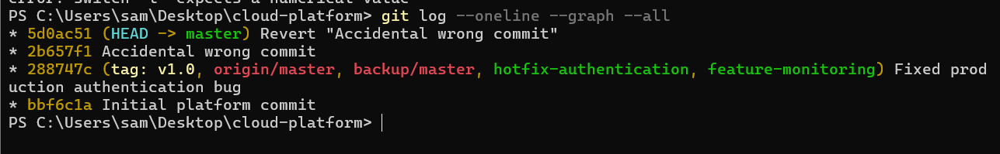


- [ ] Screenshot of rebase output (before and after)
- [ ] Screenshot of `git stash` and `git stash pop`
- [ ] Screenshot of `v1.0` tag on GitHub and/or GitLab
- [ ] Screenshot of `git remote -v` showing both remotes
- [ ] Screenshot of conflict resolution (if one occurred during rebase)

---

## 📖 Quick Reference

### Key Commands

| Command | What It Does | When to Use |
|---------|-------------|-------------|
| `git checkout -b <name>` | Creates and switches to new branch | Starting a feature or hotfix |
| `git merge <branch>` | Combines another branch into current | Bringing features into main |
| `git rebase main` | Replays your commits on top of main | Updating feature branch |
| `git stash` | Shelves uncommitted changes | Need to switch branches urgently |
| `git stash pop` | Restores the most recent stash | Back on your branch |
| `git tag -a v1.0 -m "..."` | Creates an annotated release tag | Marking a production release |
| `git reset --soft HEAD~1` | Undoes last commit, keeps changes staged | Fix commit before pushing |
| `git revert <id>` | Creates new undo commit | Undoing an already-pushed commit |
| `git remote add <name> <url>` | Adds a new remote | Connecting to GitHub, GitLab |
| `git push origin --tags` | Pushes all local tags | Publishing a release |
| `git log --oneline --graph` | Visual branch history | Checking commit history |

---

### Merge Conflict Markers — How to Read Them

```
<<<<<<< HEAD                        ← Your current branch's version
Company Website - Navigation Version
=======                             ← Divider
Company Website - Footer Version
>>>>>>> feature-footer              ← Incoming branch's version
```

**To resolve:** Delete the markers, keep what you want, then `git add .` and `git commit`.

---

### Rebase vs Merge

| | `git merge` | `git rebase` |
|-|------------|-------------|
| **History** | Parallel — shows branches diverged | Linear — as if branches never diverged |
| **Commit** | Creates a merge commit | No extra commit; rewrites hashes |
| **Safety** | Safe on shared/public branches | Only use on private/local branches |
| **Best for** | Merging features into main | Updating feature branch with latest main |

---

*Git Collaboration Lab Guide — Labs 1 & 2*