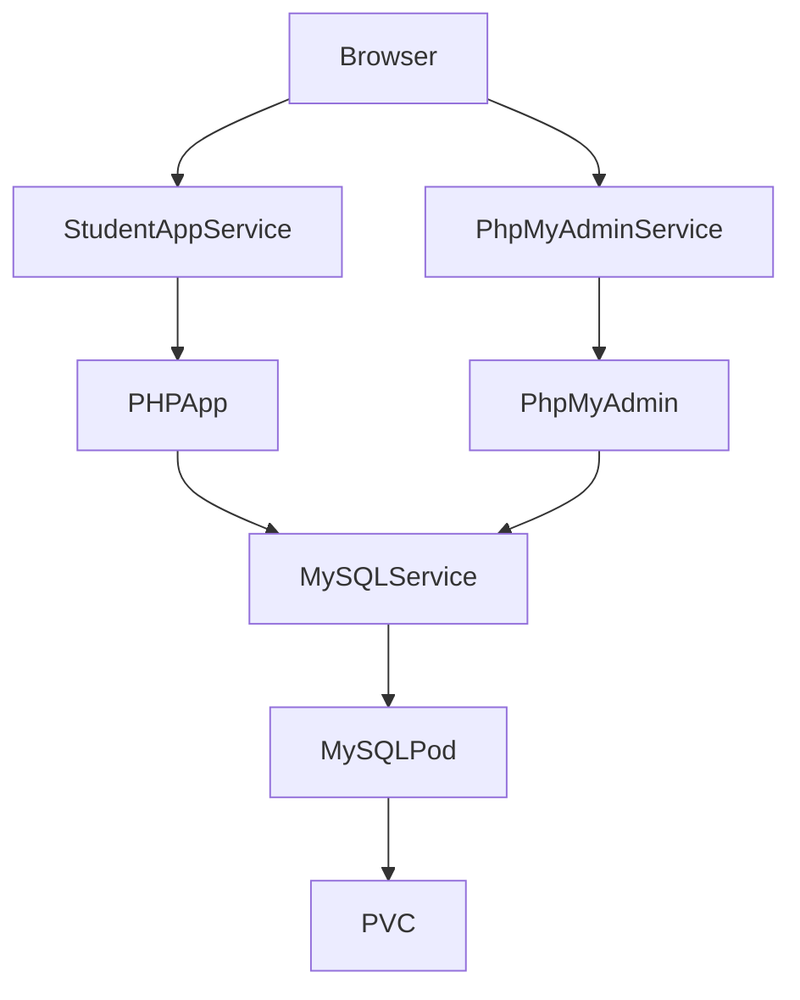

# Kubernetes Lab 1 — PHP Student Registration

## Objective
Deploy a PHP 8.2 Apache student registration system with MySQL 8 and phpMyAdmin on Minikube. The lab demonstrates Pods, Deployments, ReplicaSets, Services, ConfigMaps, Secrets, PVCs, service discovery, scaling, and self-healing.

## Technologies and structure
PHP/PDO-style prepared MySQLi, Apache, MySQL 8, phpMyAdmin, Docker, Kubernetes, Minikube, and kubectl. `app/` contains the web pages; `database/init.sql` creates `students`; `kubernetes/` contains all manifests; `screenshots/` is reserved for student evidence.

## Architecture



```text
Browser -> student-app (NodePort) -> PHP Apache -> mysql (ClusterIP) -> MySQL Pod -> mysql-pvc
Browser -> phpmyadmin (NodePort) ------------------------------^ 
```

## Prerequisites (Windows)
Install Docker Desktop, Minikube, and kubectl. Verify with `docker --version`, `minikube version`, and `kubectl version --client`. Start with `minikube start --driver=docker`, then `kubectl cluster-info` and `kubectl get nodes`.

## Build for Minikube
```powershell
minikube docker-env --shell powershell | Invoke-Expression
docker build -t student-app:latest .
```
Alternatively build normally with `docker build -t student-app .` and import using `minikube image load student-app:latest`. The Deployment uses `IfNotPresent`, so Minikube can use its local image without Docker Hub.

## Deploy in order
```bash
kubectl apply -f kubernetes/mysql-secret.yaml
kubectl apply -f kubernetes/pvc.yaml
kubectl apply -f kubernetes/mysql-deployment.yaml
kubectl apply -f kubernetes/mysql-service.yaml
kubectl apply -f kubernetes/phpmyadmin-deployment.yaml
kubectl apply -f kubernetes/phpmyadmin-service.yaml
kubectl apply -f kubernetes/configmap.yaml
kubectl apply -f kubernetes/app-secret.yaml
kubectl apply -f kubernetes/app-deployment.yaml
kubectl apply -f kubernetes/app-service.yaml
kubectl get pods,svc,pvc
```

## Access and test
Run `minikube service student-app` for the application and `minikube service phpmyadmin` for administration. Register with full name, email, student ID, course, and password; then log in and verify the dashboard. Passwords are hashed with `password_hash`; queries use prepared statements and output is escaped.

## Verification, scaling, and self-healing
```bash
kubectl get deployments; kubectl get replicasets; kubectl get configmaps; kubectl get secrets
kubectl get endpoints; kubectl get all; kubectl describe pod <pod-name>; kubectl logs <pod-name>; kubectl exec -it <pod-name> -- sh
kubectl scale deployment student-app --replicas=3
kubectl get pods
kubectl delete pod <pod-name>
kubectl get pods -w
```
The Deployment owns a ReplicaSet, which maintains the requested Pod count. The Service load-balances across ready replicas. Deleting a Pod demonstrates self-healing when the replacement appears.

## Storage and initialization
`mysql-pvc` requests 1Gi with `ReadWriteOnce` and mounts at `/var/lib/mysql`. The official MySQL image runs initialization SQL only when that directory is empty. To reset development data, run `kubectl delete -f kubernetes/` and delete the PVC before redeploying. Kubernetes Secrets are base64-encoded configuration, not a complete production secret-management solution.

## Troubleshooting
For Pending Pods run `kubectl describe pod <pod-name>` and `kubectl get events`. For CrashLoopBackOff inspect `kubectl logs` and `describe`. For ImagePullBackOff verify the image name, `minikube docker-env`, `minikube image load`, and `imagePullPolicy`. For database failures check `kubectl get svc`, `kubectl get endpoints`, and application logs. For PVC Pending run `kubectl get pv`, `kubectl describe pvc mysql-pvc`. For unreachable Services inspect selectors, labels, endpoints, and `kubectl describe svc`.

## Screenshots / Evidence
Create these files yourself; placeholders are intentional: `01-application-homepage.png`, `02-registration-page.png`, `03-phpmyadmin-dashboard.png`, `04-pods-running.png`, `05-services-running.png`, `06-pvc-created.png`, `07-three-replicas.png`, `08-pod-recreated.png`. Capture the homepage, registration form, phpMyAdmin, `kubectl get pods`, `kubectl get svc`, `kubectl get pvc` showing Bound, three replicas after scaling, and the replacement Pod after deletion. Never fabricate evidence.

## Cleanup and GitHub
```bash
kubectl delete -f kubernetes/
minikube stop
minikube delete
```
Commit source, Dockerfile, SQL, manifests, and README. Do not commit `.env`, real passwords, private keys, images, or generated files.
