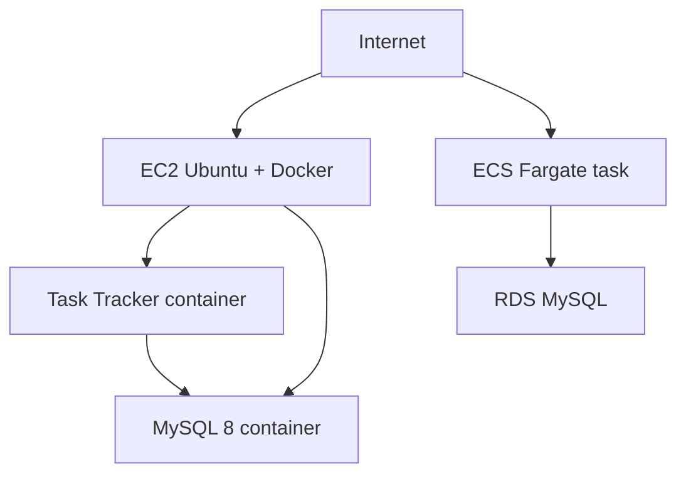

# Week 6 — AWS Container Deployment

## Week summary

This week applies Docker and networking concepts to AWS. The supplied Task Tracker image is documented for both a self-managed EC2 + MySQL deployment and a managed ECS Fargate + RDS deployment. AWS execution, screenshots, endpoints, and costs must be verified by the student and are not fabricated here.

This project documents deploying the provided `omarionya/task-tracker:latest` image in two architectures. Its internal source and environment contract were not supplied, so `DB_HOST`, `DB_PORT`, `DB_DATABASE`, `DB_USERNAME`, and `DB_PASSWORD` are documented assumptions to verify against the image owner.

## Architecture



## Prerequisites
AWS account, Docker, AWS CLI, SSH client, and (for Part 2) an IAM role, VPC/subnets, ECS, and RDS knowledge. Never commit AWS keys, `.pem` files, real passwords, account IDs, or endpoints.

## Part 1 — EC2
Launch Ubuntu Server 22.04 (64-bit) with a key pair. Store the `.pem` securely; on Linux/macOS run `chmod 400 key.pem`, then `ssh -i key.pem ubuntu@PUBLIC_IP`. Windows users can use PowerShell OpenSSH or PuTTY. Allow SSH TCP 22 from **My IP** and HTTP TCP 80 from the Internet. Do not expose MySQL 3306 publicly.

Install Docker with the official repository, then verify `docker --version`, `sudo docker run hello-world`, and `docker ps`. On the instance run `docker-network.sh`, export `MYSQL_ROOT_PASSWORD`, `MYSQL_PASSWORD`, and `DB_PASSWORD`, then run `run-mysql.sh` followed by `run-app.sh`. The app uses Docker DNS hostname `task-tracker-mysql`, not localhost. Verify with `verify.sh` and browse `http://PUBLIC_IP` (expected result after successful execution).

## Part 2 — ECS Fargate + RDS
Create an RDS MySQL database in a suitable VPC/subnet group and record its endpoint as `RDS_ENDPOINT`. Keep RDS private where possible. Allow TCP 3306 in the RDS security group **from the ECS task security group**, not `0.0.0.0/0`. Create a Fargate cluster, register `ecs/task-definition.json` after replacing placeholders, and create a service with desired count 1, `awsvpc`, public/private subnets appropriate to the design, and an HTTP security group. Use Secrets Manager/ECS secrets for production credentials rather than plaintext JSON. Expected result: a running task whose application connects to RDS.

## Local demonstration
```bash
cd local
cp .env.example .env
docker compose up
```
Open `http://localhost:8080`. Compose is only a local demonstration; AWS deployments use EC2 or ECS/RDS.

## Communication explanation (about 200 words)
On EC2, both containers join the user-defined `task-tracker-network`. Docker provides an internal DNS record for the MySQL container name, so the PHP container resolves `task-tracker-mysql` to the database container's network address and connects to TCP port 3306. The database name, username, and password are injected as environment variables when the container starts. `localhost` is incorrect inside the application because it refers to the application container itself, not its neighboring MySQL container. The network avoids publishing 3306 to the Internet; only the HTTP port is mapped to the EC2 host. In ECS, the same application settings point `DB_HOST` at the RDS endpoint. The Fargate task reaches RDS over the VPC using security-group rules that permit 3306 from the task security group. DNS and security groups provide service discovery and least-privilege network access. In both designs, credentials should come from a secure secret store, and traffic should be protected with TLS where required. The key distinction is ownership: Docker networking connects two containers on one host, while AWS VPC networking connects a managed ECS task to a managed database service.

## Screenshots / submission checklist
Use the placeholders under `screenshots/`; capture real evidence only: EC2, security group, SSH, Docker/network/containers, browser, RDS, ECS cluster/task definition/service/task/logs, and application. Include the comparison and reflection answers.

## Cleanup and cost warning
Terminate the EC2 instance, remove unused EBS volumes/security groups, scale ECS to zero and delete its service/cluster, delete temporary RDS (skip final snapshot only when appropriate), and remove ECR repositories. AWS resources can incur charges.
